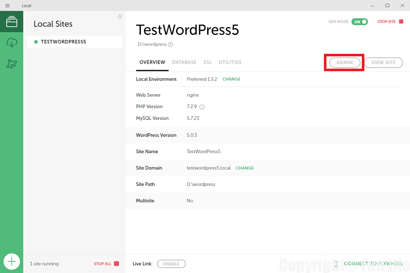

WordPressのバージョン4.x系から5.x系にバージョンアップする際に、今動いているサイト（テーマやプラグインいろいろ）がちゃんと動作するか？が一番の心配事になります。  
問題ないと言い切れるのならさっさと上げたいけど、サイトが止まると収益に影響するからなかなか踏み切れないんだよね。

そこで今回、本番環境をローカル環境に複製して、ローカル環境でWordPress 5.Xの動作確認をしようというわけ。  
本記事では、 ローカル環境にWordPressを立ち上げる ところまで紹介します。

超簡単です。

## Local を使ったWordPress環境

WordPressのローカル環境を構築するのに使用するツールが「Local by Flywheel」になります。  
Windows上に仮想環境（VirtualBox）を作成して、仮想環境上でWordPressを動かす、ということをやってくれるアプリケーションです。

仮想環境と聞くとなんやら小難しいかもしれませんが、ユーザーはアプリを介して操作するため直感的に操作できます。

### Local インストール

https://localwp.com/

「FREE DOWNLOAD」を選択する。

必要事項、

* OS「Windows」を選択する（MACなら「MAC」）
* Work Email
* Number of website

を入力し、「GET IT NOW!」でインストーラーをダウンロード開始。

完了後、実行ファイルを実行しインストールを開始する。  
途中、VirtualBoxによるユーザーアカウント制御画面が何回か表示されるが、全て許可する。

### ローカル環境にWordPress環境を構築する

「Local by Flywheel」を起動して、環境を作っていきます。
といってもポチポチしていくだけ。

#### 仮想環境を構築する

「LET’S GO!」をクリックする。

#### WordPressの環境設定を行う

「CREATE A NEW SITE」をクリックする。

サイト名を入力し「CONTINUE」をクリックする。  
サイト名は好きなように。  
「ADVANCED OPTIONS」でパスを設定しておくとよい。

PHP、MySQLのバージョンを選択する。  
こちらはサーバーに合わせて選択する。  
分からなければデフォルト（Preferred）としておく。  
こちらは後で変更可能となってます。

ユーザー名、パスワードを入力し「ADD SITE」をクリックする。  
ユーザー名、パスワードは管理者画面にログインするときに使うので覚えておく。  
なんでもよい。

しばらくすると、HOME画面が表示されます。  
これでWordPress環境は立ち上がってます。  
バージョンもしっかり5.Xですね。  

#### WordPressの管理者画面にログインする

「ADMIN」をクリックします。


「Microsoft Edge」では表示されませんでした。  
「Google Chrome」では問題ないので、「Google Chrome」で開きましょう。


#### サイトを表示する

「VIEW SITE」をクリックします。


「Microsoft Edge」では表示されませんでした。  
「Google Chrome」では問題ないので、「Google Chrome」で開きましょう。


#### WordPressの仮想環境を止める

仮想環境を止めたければ「STOP SIE」をクリックします。

## まとめ

ローカル環境が整ったことで、いろいろ試行錯誤できるようになりました。  
次はいま動いている本番環境のWordPressをローカル環境にコピーします。
